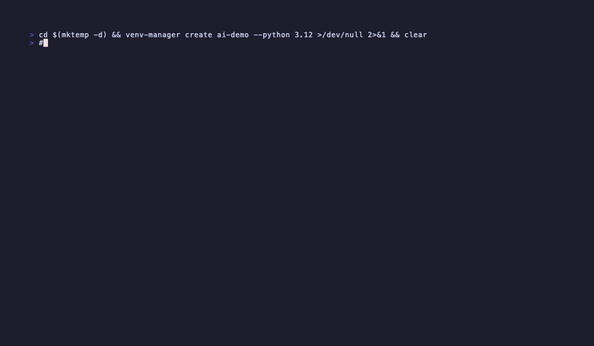

# venv-manager

[](https://github.com/jacopobonomi/venv_manager/actions/workflows/ci.yml)
[](https://pkg.go.dev/github.com/jacopobonomi/venv-manager)
[](https://opensource.org/licenses/MIT)
[](https://github.com/jacopobonomi/venv_manager/releases)
[](https://venv-manager.com/)
[](https://glama.ai/mcp/servers/jacopobonomi/venv_manager)

One Python environment control layer for developers **and every AI coding agent**.

Written in Go. One static binary, no runtime deps beyond `python3` (or `uv`, if available).



The GIF above is real: `venv-manager watch app.py --venv X` monitors a file, scans its imports with a tiny AST-lite parser, and pip-installs whatever is missing — every time the file changes. Point it at a script an LLM is iterating on and the venv converges as the code does.

---

## Why

Claude, Codex, Cursor and other coding agents can already run shell commands, create a `.venv`, and ask for approval before sensitive operations. What they do not share is durable Python environment state.

Sandboxing protects the machine. `venv-manager` protects the **workflow**: it gives every agent the same environments, metadata, package history and recovery path, independent of the client that happens to be running.

Two failure modes drove this tool:

1. **Human sprawl.** Venvs multiply across `~`, cache directories eat GB, activation syntax varies by shell, and cloning "the env that worked" means copy-pasting `pip freeze` between terminals.
2. **Agent sprawl.** AI agents can install into the wrong interpreter, leave partial changes behind, and lose environment context when you switch client or start a new session.

`venv-manager` solves (1) with a clean CLI and (2) with a shared **Model Context Protocol server**, a persistent **registry**, typed **snapshots and diffs**, reversible package changes, **ephemeral venvs** with OS-level sandboxing, and a **file watcher** that keeps a venv in sync with evolving code.

### What the agent sandbox does not solve

| Agent capability | Shared environment control |
|---|---|
| Approves or blocks a shell command | Records which environment belongs to which project |
| Restricts filesystem and network access | Preserves state across Claude, Codex and other clients |
| Creates a venv when prompted | Tracks creation and real last-use metadata |
| Runs `pip`, Poetry or `uv` | Shows package-level changes between snapshots |
| Stops an unsafe action | Rolls a damaged environment back to a known state |

The two layers complement each other: agent permissions control **what may happen now**; `venv-manager` records **what exists, what changed, and how to recover**.

---

## Install

**Homebrew** (macOS, Linux):

```bash
brew install jacopobonomi/tap/venv-manager
```

**One-line install script** (macOS, Linux):

```bash
curl -sSL https://raw.githubusercontent.com/jacopobonomi/venv_manager/main/install.sh | bash
```

**From source:**

```bash
git clone https://github.com/jacopobonomi/venv_manager && cd venv_manager
make install
```

Requires Go 1.24+ to build, Python 3.x at runtime.

---

## AI integration

### MCP server

Exposes venv operations as native [Model Context Protocol](https://modelcontextprotocol.io/) tools. Claude, Codex, Cursor, Zed and other MCP clients call the same typed tools and operate on the same persistent environment state instead of guessing shell invocations independently.

Wire it up in Claude Desktop (`~/Library/Application Support/Claude/claude_desktop_config.json`):

```json
{
  "mcpServers": {
    "venv-manager": {
      "command": "venv-manager",
      "args": ["mcp", "--policy", "safe"]
    }
  }
}
```

Tools exposed (JSON-RPC 2.0 over stdio):

| Tool | Purpose |
|---|---|
| `list_venvs` | Names of all managed venvs. |
| `create_venv` | `{name, python_version?}` → new venv, uses `uv` if configured. |
| `remove_venv` | `{name}` → recursive delete. |
| `describe_venv` | `{name}` → full snapshot: python version, packages, size, freeze hash, activation commands per shell. |
| `install_packages` | `{name, packages[] | requirements_file}` → pip install with combined stdout+stderr returned. |
| `run_in_venv` | `{name, command[]}` → exec in the venv with `VIRTUAL_ENV` set and `PATH` prepended. Captured output. |
| `exec_ephemeral` | `{packages[], python_version?, command[]}` → create-install-run-destroy in a single call. |
| `snapshot_venv` | `{name, label?}` → capture pip freeze; enables `rollback_venv`. |
| `list_snapshots` | `{name}` → newest-first. |
| `rollback_venv` | `{name, snapshot_id?}` → install snapshot state, then remove packages absent from it. |
| `diff_snapshots` | `{name, from_snapshot_id, to_snapshot_id?}` → package-level diff; omit `to_snapshot_id` for current state. |
| `scan_imports` | `{path, venv?}` → third-party imports found; when `venv` is passed, reports which are missing. |
| `list_registry` | Persistent project, tag, creation, and last-used metadata. |
| `set_registry_metadata` | `{name, project?, tags[]?, confirm?}` → update registry metadata. |
| `doctor` | Python versions on `PATH`, `uv` availability, broken venvs. |

The server defaults to `safe` policy. Installation, rollback, removal, and arbitrary execution require `confirm: true`. Use `--policy read-only` for inspection-only clients, `--policy full` for unrestricted compatibility, and repeat `--allow-tool NAME` to expose only an explicit subset. These policies are defense in depth: they remain consistent even when different clients have different approval settings.

Implementation uses zero third-party MCP dependencies. Newline-delimited JSON-RPC 2.0 on stdin/stdout.

### Ephemeral execution (`uvx`-style, sandboxed)

```bash
# create → install → run → destroy, all in one call
venv-manager exec --with requests -- python -c "import requests; print(requests.__version__)"

# with an OS sandbox: no network, no writes outside /tmp + the ephemeral venv
venv-manager exec --sandbox --with pandas -- python untrusted.py
```

`--sandbox` uses `sandbox-exec` on macOS and `bwrap` on Linux. Deny-by-default profile with explicit allow-lists for the venv path, `/tmp`, and process management. Network is unshared.

### File watcher

```bash
venv-manager watch app.py --venv myenv
```

`fsnotify` on the parent directory (survives editor atomic-rename writes), 500 ms debounce, then:

1. AST-lite regex scan of `.py` files (skips docstrings, relative imports, local modules/packages, and vendored dirs like `.venv`, `.git`, `__pycache__`, `node_modules`)
2. Filter against a stdlib module set
3. Resolve import-name → pip-package aliases (`cv2` → `opencv-python`, `sklearn` → `scikit-learn`, `PIL` → `Pillow`, `bs4` → `beautifulsoup4`, `yaml` → `PyYAML`, ...)
4. Diff against installed packages
5. `pip install` the delta

The venv is always a superset of the current file's requirements. This is the loop the demo GIF above exercises.

### Persistent registry

Every environment is tracked in `~/.venvs/.venv-manager/registry.json` with creation and last-used timestamps, an optional project path, and tags. Writes are atomic and the registry reconciles itself with live venv directories.

```bash
venv-manager registry
venv-manager registry set research --project ~/work/paper --tag data,ai
venv-manager registry research
```

`prune` uses registry `last_used_at` rather than directory modification time when metadata is available.

### JSON snapshot as a single-call context primer

```bash
venv-manager describe myenv
```

```json
{
  "name": "myenv",
  "path": "/Users/me/.venvs/myenv",
  "python_version": "3.12.6",
  "python_path": "/Users/me/.venvs/myenv/bin/python",
  "pip_path": "/Users/me/.venvs/myenv/bin/pip",
  "packages": ["requests==2.34.2", "rich==15.0.0", ...],
  "package_count": 12,
  "size_bytes": 45123456,
  "size_human": "43.03 MB",
  "modified_at": "2026-07-20T15:41:35Z",
  "freeze_hash": "sha256:2c58d830...",
  "activation": {
    "bash": "source '/Users/me/.venvs/myenv/bin/activate'",
    "zsh":  "source '/Users/me/.venvs/myenv/bin/activate'",
    "fish": "source '/Users/me/.venvs/myenv/bin/activate.fish'"
  }
}
```

One tool call, everything an agent needs to reason about the environment. `freeze_hash` lets an agent detect drift between two `describe` calls in O(1) instead of diffing package lists.

---

## Commands

| Command | Description |
|---|---|
| `create <name> [--python VER]` | Create a venv. Uses `uv` when `use_uv: true` in config. |
| `list [--json]` | List venvs. |
| `remove <name>` | Delete a venv. |
| `rename <old> <new>` | Rename and re-generate activation scripts via `python -m venv --upgrade`. |
| `clone <src> <dst>` | Fresh venv seeded with `pip freeze` of source. |
| `packages <name> [--json]` | Installed packages. |
| `install <name> <requirements>` | `pip install -r`. |
| `upgrade [name] [--global]` | Upgrade outdated packages (per venv or all). |
| `clean [name] [--global]` | Purge pip cache + `__pycache__` dirs. |
| `size [name] [--global] [--json]` | Disk usage. |
| `activate <name>` | Print shell command for `eval $(...)`. |
| `deactivate` | Print `deactivate`. |
| `run <name> -- <cmd>` | Execute in a venv without activating; inherited stdio. |
| `exec [--with pkgs] [-r req] [--python V] [--sandbox] [--keep] -- <cmd>` | Ephemeral venv run. |
| `describe <name>` | Full JSON snapshot (see above). |
| `scan <path> [--venv N] [--json]` | Extract third-party imports; check against venv. |
| `watch <path> --venv N` | Auto-install missing imports on file change. |
| `snapshot <name> [-l LABEL]` | Capture pip-freeze state. |
| `snapshots <name> [--json]` | List snapshots (newest first). |
| `rollback <name> [snapshot-id]` | Install snapshot state first, then remove packages absent from it. |
| `snapshot-diff <name> <from> [to]` | Diff snapshots, or compare one snapshot with current state. |
| `export <name>` | Print portable manifest (name + python version + freeze) as JSON. |
| `import <manifest.json>` | Recreate venv from manifest. |
| `prune [--days N] [--dry-run] [--yes] [--json]` | Report stale venvs; require `--yes` before removal. |
| `registry [name]` | Show persistent creation, usage, project, and tag metadata. |
| `registry set <name> [--project PATH] [--tag TAGS]` | Update project association and tags. |
| `doctor [--json]` | Diagnose python versions, uv, broken venvs. |
| `config show|path|init` | Show / locate / bootstrap the config. |
| `mcp [--policy MODE] [--allow-tool NAME]` | MCP server with read-only, safe, or full authorization policy. |
| `tui` | Bubble Tea TUI browser. |
| `completion [bash|zsh|fish|powershell]` | Shell completion scripts. |

Most read commands also accept `--json` for stable, machine-parseable output.

---

## Configuration

`~/.config/venv-manager/config.json` (respects `$XDG_CONFIG_HOME` and `$VENV_MANAGER_CONFIG`):

```json
{
  "base_dir": "/custom/path/to/venvs",
  "default_python": "3.12",
  "use_uv": true,
  "prune_after_days": 90
}
```

Bootstrap: `venv-manager config init`.

## uv backend

If [`uv`](https://github.com/astral-sh/uv) is on `PATH` and `use_uv: true`, `create` runs `uv venv`. Typically 10–100× faster than `python -m venv` on cold cache.

---

## Development

```bash
make build            # go build -o bin/venv-manager
make test             # unit tests
make demo             # regenerate scripts/demo/demo.gif via VHS
go test -tags=integration ./internal/manager/...   # integration tests (real pip, real PyPI)
```

CI runs `go vet`, `go test -race` on Ubuntu + macOS, and integration tests on Ubuntu with Python 3.12.

Architecture:

```
cmd/venv-manager/           cobra CLI
internal/manager/           core operations (create, install, snapshot, scan, watch, exec, describe, ...)
internal/config/            XDG-aware JSON config
internal/mcp/               JSON-RPC 2.0 MCP server (stdio)
internal/tui/               Bubble Tea browser
internal/utils/             platform helpers, size formatting
```

## License

MIT.

## Author

[Jacopo Bonomi](https://github.com/jacopobonomi)
